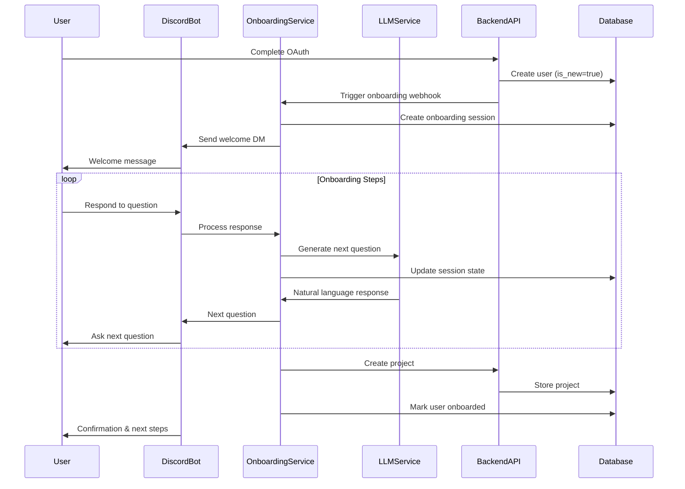

# Design Document

## Overview

The Discord DM Onboarding feature provides a conversational, natural language interface for new users to complete their initial setup through Discord Direct Messages. This eliminates the need for web-based forms and keeps users in their preferred communication platform. The system uses a state machine to track onboarding progress, leverages the existing LLM service for natural responses, and integrates with the backend API to create user projects.

## Architecture

### High-Level Flow

```
User completes OAuth → Backend detects new user → Triggers onboarding webhook → 
Discord Bot sends welcome DM → User responds conversationally → 
Bot collects information step-by-step → Creates project via API → 
Marks user as onboarded → User can now use the assistant
```

### Component Interaction



## Components and Interfaces

### 1. Onboarding Service

**Purpose:** Manages the onboarding state machine and orchestrates the conversation flow.

**Responsibilities:**
- Track onboarding session state
- Validate user inputs
- Coordinate with LLM service for response generation
- Create projects via backend API
- Handle errors and edge cases

**Interface:**
```python
class OnboardingService:
    async def start_onboarding(self, user_id: str, discord_id: str) -> OnboardingSession
    async def process_message(self, user_id: str, message: str) -> OnboardingResponse
    async def get_session(self, user_id: str) -> Optional[OnboardingSession]
    async def cancel_onboarding(self, user_id: str) -> None
    async def restart_onboarding(self, user_id: str) -> OnboardingSession
    async def complete_onboarding(self, user_id: str) -> Project
```

### 2. Onboarding State Machine

**Purpose:** Define the steps and transitions in the onboarding flow.

**States:**
- `WELCOME` - Initial greeting sent
- `COLLECT_PROJECT_NAME` - Asking for project name
- `COLLECT_GOAL` - Asking for project goal
- `COLLECT_DEADLINE` - Asking for deadline
- `CONFIRM_DEADLINE` - Confirming parsed deadline
- `COLLECT_CHECKIN_FREQUENCY` - Asking about check-in preferences
- `COLLECT_TONE` - Asking about communication tone
- `CONFIRM_DETAILS` - Showing summary for confirmation
- `CREATING_PROJECT` - Creating project in backend
- `COMPLETED` - Onboarding finished
- `PAUSED` - User requested pause
- `FAILED` - Error occurred

**Transitions:**
```python
class OnboardingState(Enum):
    WELCOME = "welcome"
    COLLECT_PROJECT_NAME = "collect_project_name"
    COLLECT_GOAL = "collect_goal"
    COLLECT_DEADLINE = "collect_deadline"
    CONFIRM_DEADLINE = "confirm_deadline"
    COLLECT_CHECKIN_FREQUENCY = "collect_checkin_frequency"
    COLLECT_TONE = "collect_tone"
    CONFIRM_DETAILS = "confirm_details"
    CREATING_PROJECT = "creating_project"
    COMPLETED = "completed"
    PAUSED = "paused"
    FAILED = "failed"
```

### 3. Discord Bot Handler

**Purpose:** Handle Discord DM events and route messages to the onboarding service.

**Responsibilities:**
- Listen for DM messages from users in onboarding
- Send formatted messages to users
- Handle Discord API errors (DMs disabled, etc.)
- Format responses with Discord markdown

**Interface:**
```python
class OnboardingBotHandler:
    async def on_message(self, message: discord.Message) -> None
    async def send_onboarding_message(self, user_id: str, content: str) -> bool
    async def handle_dm_failure(self, user_id: str, error: Exception) -> None
```

### 4. Onboarding Webhook Handler

**Purpose:** Receive notifications from backend when new users complete OAuth.

**Endpoint:**
```
POST /webhooks/onboarding/start
Body: {
    "user_id": "uuid",
    "discord_id": "string",
    "email": "string"
}
```

### 5. Backend API Integration

**Purpose:** Create projects and update user status via existing backend APIs.

**Used Endpoints:**
- `POST /api/projects` - Create new project
- `PATCH /api/users/{user_id}` - Update user (mark as onboarded)
- `GET /api/users/{user_id}` - Fetch user details

## Data Models

### OnboardingSession

```python
class OnboardingSession(Base):
    __tablename__ = "onboarding_sessions"
    
    id: UUID = Column(UUID(as_uuid=True), primary_key=True, default=uuid.uuid4)
    user_id: UUID = Column(UUID(as_uuid=True), ForeignKey("users.id"), nullable=False)
    discord_id: str = Column(String, nullable=False)
    
    # State tracking
    current_state: OnboardingState = Column(Enum(OnboardingState), nullable=False)
    started_at: datetime = Column(DateTime, nullable=False, default=datetime.utcnow)
    last_activity_at: datetime = Column(DateTime, nullable=False, default=datetime.utcnow)
    completed_at: Optional[datetime] = Column(DateTime, nullable=True)
    
    # Collected data
    project_name: Optional[str] = Column(String, nullable=True)
    project_goal: Optional[str] = Column(Text, nullable=True)
    deadline: Optional[datetime] = Column(DateTime, nullable=True)
    checkin_frequency: Optional[str] = Column(String, nullable=True)
    preferred_tone: Optional[str] = Column(String, nullable=True)
    
    # Conversation history
    conversation_history: List[dict] = Column(JSON, nullable=False, default=list)
    
    # Metadata
    retry_count: int = Column(Integer, default=0)
    error_message: Optional[str] = Column(Text, nullable=True)
    
    created_at: datetime = Column(DateTime, nullable=False, default=datetime.utcnow)
    updated_at: datetime = Column(DateTime, nullable=False, default=datetime.utcnow, onupdate=datetime.utcnow)
```

### OnboardingResponse

```python
@dataclass
class OnboardingResponse:
    message: str  # Message to send to user
    next_state: OnboardingState  # Next state to transition to
    is_complete: bool  # Whether onboarding is finished
    requires_confirmation: bool  # Whether this needs user confirmation
    metadata: dict  # Additional context (e.g., parsed deadline)
```

## Correctness Properties

*A property is a characteristic or behavior that should hold true across all valid executions of a system—essentially, a formal statement about what the system should do. Properties serve as the bridge between human-readable specifications and machine-verifiable correctness guarantees.*

### Property 1: Onboarding session creation

*For any* new user completing OAuth, starting the onboarding flow should create exactly one onboarding session in the database with state `WELCOME`.

**Validates: Requirements 1.4**

### Property 2: State transition validity

*For any* onboarding session and user message, processing the message should transition to a valid next state according to the state machine rules.

**Validates: Requirements 2.1**

### Property 3: Data persistence

*For any* onboarding session, after each user response is processed, the collected data should be persisted to the database before sending the next question.

**Validates: Requirements 6.2**

### Property 4: Session resumption

*For any* interrupted onboarding session, when the user returns, the system should resume from the last completed state with all previously collected data intact.

**Validates: Requirements 6.4**

### Property 5: Completion idempotency

*For any* onboarding session, completing onboarding multiple times should result in only one project being created.

**Validates: Requirements 5.1**

### Property 6: DM failure handling

*For any* user where Discord DM delivery fails, the system should detect the failure and not create an onboarding session.

**Validates: Requirements 7.1, 7.2**

### Property 7: Input validation

*For any* user input during onboarding, invalid inputs (e.g., past deadlines, malformed dates) should trigger a clarification request without advancing the state.

**Validates: Requirements 3.1, 3.2**

### Property 8: Cancellation cleanup

*For any* onboarding session, when a user cancels, the session state should be set to `PAUSED` and no project should be created.

**Validates: Requirements 9.1, 9.2**

### Property 9: Conversation history preservation

*For any* onboarding session, each message exchange should be appended to the conversation history in chronological order.

**Validates: Requirements 8.3**

### Property 10: Onboarding completion marking

*For any* user who completes onboarding, the user's `is_new` flag should be set to `false` and the onboarding session should be marked as `COMPLETED`.

**Validates: Requirements 5.4**

## Error Handling

### DM Delivery Failures

**Scenario:** User has DMs disabled or has blocked the bot

**Handling:**
1. Catch `discord.Forbidden` exception
2. Log the failure with user ID
3. Mark user for web-based onboarding
4. Update OAuth callback to redirect to web onboarding page
5. Send email notification (if email available) with instructions

### Backend API Failures

**Scenario:** Project creation fails due to API error

**Handling:**
1. Catch API exception
2. Log error with full context
3. Inform user of temporary issue
4. Store collected data in onboarding session
5. Offer to retry or contact support
6. Set session state to `FAILED` with error details

### LLM Service Unavailable

**Scenario:** LLM service is down or slow

**Handling:**
1. Implement timeout (5 seconds)
2. Fall back to templated responses
3. Log degraded mode operation
4. Continue onboarding with simpler questions
5. Resume LLM usage when available

### User Abandonment

**Scenario:** User stops responding mid-onboarding

**Handling:**
1. After 24 hours of inactivity, send gentle reminder DM
2. After 7 days, mark session as abandoned
3. Keep session data for 30 days for potential resumption
4. Send final reminder before data deletion

### Invalid Input Handling

**Scenario:** User provides ambiguous or invalid data

**Handling:**
1. Use LLM to interpret intent
2. If still unclear, ask clarifying question
3. Provide examples of valid inputs
4. Allow user to skip and return later
5. Track retry count, offer help after 3 attempts

## Testing Strategy

### Unit Tests

**Onboarding Service:**
- Test state transitions for each valid input
- Test invalid input handling
- Test session creation and retrieval
- Test project creation via API
- Test cancellation and restart logic

**State Machine:**
- Test all valid state transitions
- Test invalid transitions are rejected
- Test state persistence

**Discord Bot Handler:**
- Test message routing to onboarding service
- Test DM sending with mocked Discord API
- Test error handling for DM failures

### Property-Based Tests

**Framework:** Hypothesis (Python)

**Property 1: Session Creation**
```python
@given(user_id=st.uuids(), discord_id=st.text(min_size=1))
async def test_onboarding_session_creation(user_id, discord_id):
    """
    Feature: discord-dm-onboarding, Property 1: Onboarding session creation
    Validates: Requirements 1.4
    """
    session = await onboarding_service.start_onboarding(user_id, discord_id)
    assert session.current_state == OnboardingState.WELCOME
    assert session.user_id == user_id
    assert session.discord_id == discord_id
```

**Property 2: State Transition Validity**
```python
@given(
    session=onboarding_sessions(),
    message=st.text(min_size=1)
)
async def test_state_transition_validity(session, message):
    """
    Feature: discord-dm-onboarding, Property 2: State transition validity
    Validates: Requirements 2.1
    """
    initial_state = session.current_state
    response = await onboarding_service.process_message(session.user_id, message)
    
    # Verify transition is valid according to state machine
    assert is_valid_transition(initial_state, response.next_state)
```

**Property 3: Data Persistence**
```python
@given(
    session=onboarding_sessions(),
    project_name=st.text(min_size=1, max_size=100)
)
async def test_data_persistence(session, project_name):
    """
    Feature: discord-dm-onboarding, Property 3: Data persistence
    Validates: Requirements 6.2
    """
    await onboarding_service.process_message(session.user_id, project_name)
    
    # Fetch session from database
    updated_session = await onboarding_service.get_session(session.user_id)
    assert updated_session.project_name == project_name
```

**Property 4: Session Resumption**
```python
@given(
    session=onboarding_sessions(with_partial_data=True)
)
async def test_session_resumption(session):
    """
    Feature: discord-dm-onboarding, Property 4: Session resumption
    Validates: Requirements 6.4
    """
    original_data = {
        "project_name": session.project_name,
        "project_goal": session.project_goal,
        "state": session.current_state
    }
    
    # Simulate interruption and resumption
    resumed_session = await onboarding_service.get_session(session.user_id)
    
    assert resumed_session.project_name == original_data["project_name"]
    assert resumed_session.project_goal == original_data["project_goal"]
    assert resumed_session.current_state == original_data["state"]
```

**Property 5: Completion Idempotency**
```python
@given(session=completed_onboarding_sessions())
async def test_completion_idempotency(session):
    """
    Feature: discord-dm-onboarding, Property 5: Completion idempotency
    Validates: Requirements 5.1
    """
    # Complete onboarding first time
    project1 = await onboarding_service.complete_onboarding(session.user_id)
    
    # Attempt to complete again
    project2 = await onboarding_service.complete_onboarding(session.user_id)
    
    # Should return same project, not create new one
    assert project1.id == project2.id
```

**Property 6: DM Failure Handling**
```python
@given(user_id=st.uuids(), discord_id=st.text(min_size=1))
async def test_dm_failure_handling(user_id, discord_id):
    """
    Feature: discord-dm-onboarding, Property 6: DM failure handling
    Validates: Requirements 7.1, 7.2
    """
    # Mock Discord API to raise Forbidden error
    with mock_discord_dm_failure():
        result = await onboarding_service.start_onboarding(user_id, discord_id)
        
        # Should not create session
        assert result is None
        
        # Should log failure
        assert_logged("DM delivery failed", user_id=user_id)
```

**Property 7: Input Validation**
```python
@given(
    session=onboarding_sessions(state=OnboardingState.COLLECT_DEADLINE),
    invalid_date=st.one_of(
        st.text(min_size=1, max_size=20),  # Random text
        st.datetimes(max_value=datetime.now())  # Past dates
    )
)
async def test_input_validation(session, invalid_date):
    """
    Feature: discord-dm-onboarding, Property 7: Input validation
    Validates: Requirements 3.1, 3.2
    """
    initial_state = session.current_state
    response = await onboarding_service.process_message(
        session.user_id, 
        str(invalid_date)
    )
    
    # State should not advance
    assert response.next_state == initial_state
    
    # Should request clarification
    assert "clarif" in response.message.lower() or "example" in response.message.lower()
```

**Property 8: Cancellation Cleanup**
```python
@given(session=onboarding_sessions())
async def test_cancellation_cleanup(session):
    """
    Feature: discord-dm-onboarding, Property 8: Cancellation cleanup
    Validates: Requirements 9.1, 9.2
    """
    await onboarding_service.cancel_onboarding(session.user_id)
    
    updated_session = await onboarding_service.get_session(session.user_id)
    assert updated_session.current_state == OnboardingState.PAUSED
    
    # Verify no project was created
    projects = await get_user_projects(session.user_id)
    assert len(projects) == 0
```

**Property 9: Conversation History Preservation**
```python
@given(
    session=onboarding_sessions(),
    messages=st.lists(st.text(min_size=1), min_size=1, max_size=10)
)
async def test_conversation_history_preservation(session, messages):
    """
    Feature: discord-dm-onboarding, Property 9: Conversation history preservation
    Validates: Requirements 8.3
    """
    for message in messages:
        await onboarding_service.process_message(session.user_id, message)
    
    updated_session = await onboarding_service.get_session(session.user_id)
    
    # All messages should be in history
    assert len(updated_session.conversation_history) >= len(messages)
    
    # Messages should be in chronological order
    timestamps = [msg["timestamp"] for msg in updated_session.conversation_history]
    assert timestamps == sorted(timestamps)
```

**Property 10: Onboarding Completion Marking**
```python
@given(session=completed_onboarding_sessions())
async def test_onboarding_completion_marking(session):
    """
    Feature: discord-dm-onboarding, Property 10: Onboarding completion marking
    Validates: Requirements 5.4
    """
    await onboarding_service.complete_onboarding(session.user_id)
    
    # Check session is marked complete
    updated_session = await onboarding_service.get_session(session.user_id)
    assert updated_session.current_state == OnboardingState.COMPLETED
    assert updated_session.completed_at is not None
    
    # Check user is marked as onboarded
    user = await get_user(session.user_id)
    assert user.is_new == False
```

### Integration Tests

**End-to-End Onboarding Flow:**
- Test complete onboarding from OAuth to project creation
- Test with various user inputs (valid, invalid, edge cases)
- Test resumption after interruption
- Test cancellation and restart

**Discord Bot Integration:**
- Test DM sending and receiving with Discord test bot
- Test error handling for various Discord API errors
- Test message formatting and markdown rendering

**Backend API Integration:**
- Test project creation with real backend API
- Test user update operations
- Test error handling for API failures

### Manual Testing Scenarios

1. **Happy Path:** Complete onboarding with valid inputs
2. **Invalid Inputs:** Test with malformed dates, empty responses
3. **Interruption:** Start onboarding, wait, then resume
4. **Cancellation:** Cancel mid-flow and verify cleanup
5. **DM Disabled:** Test with user who has DMs disabled
6. **API Failure:** Simulate backend API errors
7. **LLM Failure:** Test with LLM service unavailable

## Implementation Notes

### Discord Bot Permissions

Required bot permissions:
- Send Messages (in DMs)
- Read Message History
- Use External Emojis (for better UX)

### Rate Limiting

- Implement exponential backoff for Discord API calls
- Limit to 1 message per second per user
- Queue messages if rate limit hit

### Security Considerations

- Validate all user inputs before storing
- Sanitize inputs before passing to LLM
- Use correlation IDs for request tracing
- Redact PII in logs
- Implement CSRF protection for webhook endpoint

### Performance Considerations

- Cache onboarding sessions in Redis for fast access
- Use async/await throughout for non-blocking I/O
- Implement connection pooling for database
- Set reasonable timeouts for all external calls

### Monitoring and Alerts

**Metrics to Track:**
- Onboarding start rate
- Onboarding completion rate
- Average time to complete
- Drop-off rate by step
- DM delivery failure rate
- API error rate

**Alerts:**
- DM delivery failure rate > 10%
- Onboarding completion rate < 50%
- API error rate > 5%
- Average completion time > 30 minutes
